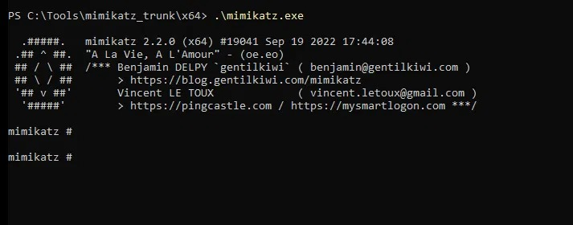
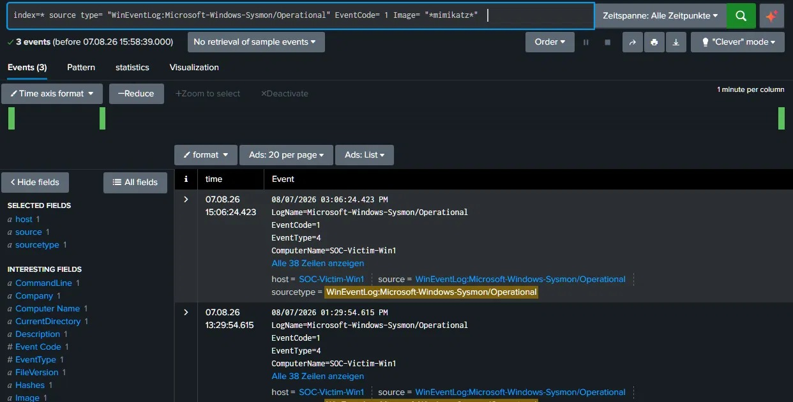
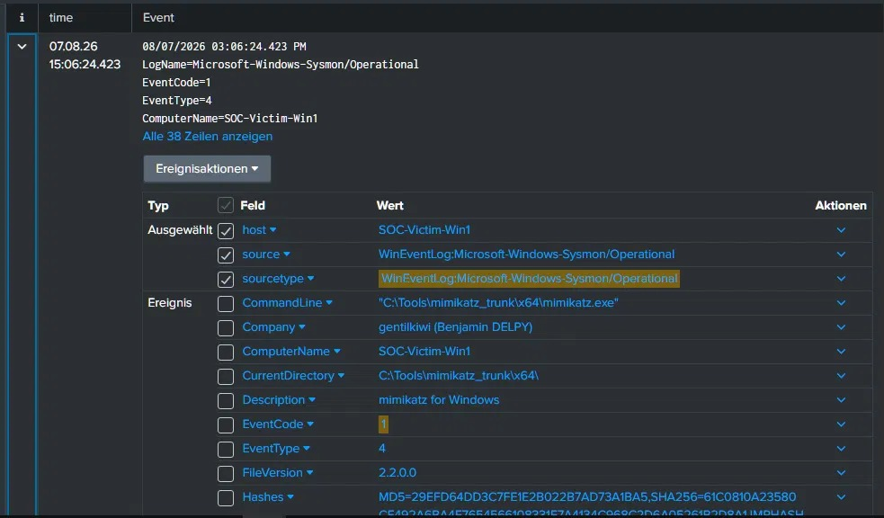
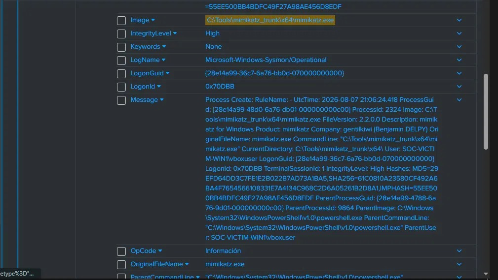
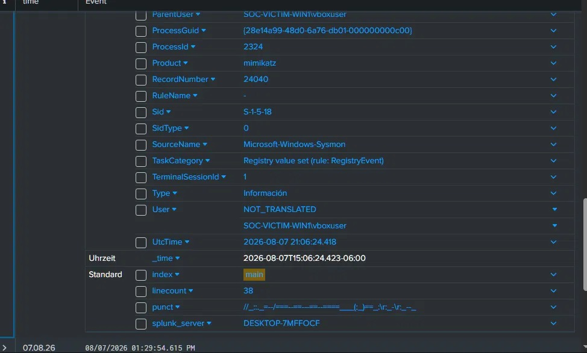
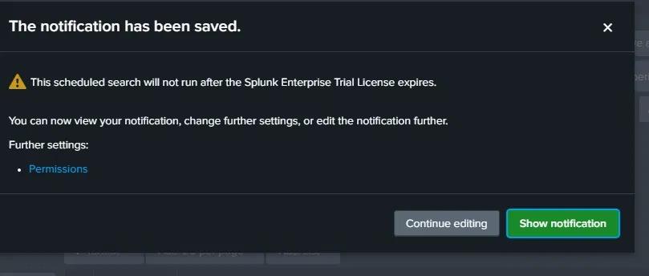
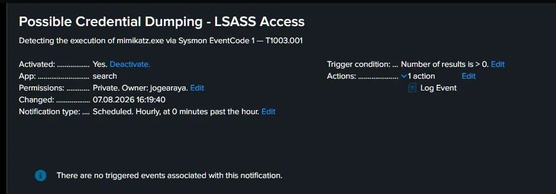

# Detección de Credential Dumping vía Mimikatz — T1003.001

**Autor:** Jorge Andrés Araya Chinchilla
**Fecha:** 07 de agosto de 2026  
**Entorno:** Lab aislado (VirtualBox — Host-only network)

---

### Resumen

Simulé un ataque de robo de credenciales usando Mimikatz contra una VM Windows en un entorno de lab aislado (VirtualBox) Configuré Sysmon como fuente de telemetría y Splunk como SIEM para detectar la ejecución del binario, técnica documentada como **T1003.001 (OS Credential Dumping: LSASS Memory)** en MITRE ATT&CK. Logré detectar el ataque mediante una búsqueda en Splunk sobre eventos de Sysmon (EventCode 1 — Process Create), identificando la ejecución de `mimikatz.exe` lanzada desde `powershell.exe` con nivel de integridad High.

---

### Entorno del lab

- **Víctima:** Windows (VM VirtualBox) — Hostname: `SOC-Victim-Win1`
- **SIEM:** Splunk Enterprise, instalado en el host
- **Fuente de telemetría:** Sysmon (config: SwiftOnSecurity) + Splunk Universal Forwarder
- **Red:** VirtualBox (aislada de la red doméstica)

---

### Ejecución del ataque

Mimikatz fue descargado desde el repositorio oficial (`gentilkiwi/mimikatz` en GitHub, release v2.2.0) y ejecutado desde PowerShell con privilegios de Administrador.

**Comandos ejecutados:**

- `privilege::debug`
- `sekurlsa::logonpasswords`

**Hora de ejecución:** 2026-08-07 21:06:24 UTC  
**Usuario:** `SOC-VICTIM-WIN1\vboxuser`  
**Proceso padre:** `C:\Windows\System32\WindowsPowerShell\v1.0\powershell.exe`

---

### Detección en Splunk

### Búsqueda por nombre de proceso (EventCode 1 Process Create)

Búsqueda utilizada:

`index=* sourcetype="WinEventLog:Microsoft-Windows-Sysmon/Operational" EventCode=1 Image="*mimikatz*"`

**Resultado: 3 eventos detectados**

### Detalle del Evento escogido

Los campos clave del evento confirman la actividad maliciosa:

---

### Análisis

El campo clave que confirma la actividad maliciosa es la combinación de:

- **`Image`:** `C:\Tools\mimikatz_trunk\x64\mimikatz.exe` — el binario de Mimikatz ejecutado directamente
- **`ParentImage`:** `C:\Windows\System32\WindowsPowerShell\v1.0\powershell.exe` — lanzado desde PowerShell, patrón típico de un atacante que ya tiene acceso interactivo al sistema
- **`IntegrityLevel`:** `High` — ejecutado con privilegios elevados (Administrador), condición necesaria para acceder a la memoria de LSASS
- **`ParentUser`:** `SOC-VICTIM-WIN1\vboxuser` — la cuenta comprometida que ejecutó el ataque

El proceso padre `powershell.exe` lanzando `mimikatz.exe` con nivel de integridad High es un patrón desconocido claro, un proceso legítimo del sistema no tiene razón para llamar a un ejecutable con ese nombre, firma digital de `gentilkiwi`, desde un directorio no estándar como `C:\Tools\`.

Nota: Las protecciones modernas de Windows 11 (RunAsPPL con valor 2, que activa protección a nivel UEFI) bloquearon el volcado directo de credenciales desde LSASS. Sin embargo, la ejecución del binario sí quedó completamente registrada por Sysmon (EventCode 1), que es suficiente evidencia de detección para un SOC — en un entorno real, la alerta dispararía una respuesta antes de que el atacante tuviera oportunidad de sortear estas protecciones.

---

### Indicadores de Compromiso (IOC)

- Nombre de proceso  `mimikatz.exe` 
- Ruta  `C:\Tools\mimikatz_trunk\x64\mimikatz.exe`
- Hash MD5  `29EFD64DD3C7FE1E2B022B7AD73A1BA5` 
- Hash SHA256  `61C0810A23580CF492A6BA4F7654566108331E7A4134C968C2D6A05261B2D8A1`
- Proceso padre  `powershell.exe`
- Usuario  `SOC-VICTIM-WIN1\vboxuser`
- Técnica  `MITRE ATT&CK T1003.001 — OS Credential Dumping: LSASS Memory`

---

### Alerta configurada

- **Nombre:** Posible Credential Dumping - LSASS Access
- **Descripción:** Detecta ejecución de mimikatz.exe vía Sysmon EventCode 1 — T1003.001
- **Búsqueda base:** `index=* sourcetype="WinEventLog:Microsoft-Windows-Sysmon/Operational" EventCode=1 Image="*mimikatz*"`
- **Frecuencia:** cada hora (Scheduled, Hourly)
- **Condición:** Number of results is > 0
- **Acción:** Log Event
- **Owner:** jogearaya
- **Activada:** Sí

---

### Remediación

- Aislar el equipo comprometido (`SOC-Victim-Win1`) de la red inmediatamente
- Resetear credenciales del usuario afectado (`vboxuser`) y cualquier otra cuenta con sesión activa en el equipo al momento del ataque
- Investigar el vector de entrada inicial (¿cómo llegó el atacante a tener acceso a PowerShell con privilegios de Admin?)
- Revisar si hubo movimiento lateral con las credenciales obtenidas
- Buscar persistencia: revisar tareas programadas, servicios instalados, claves de registro de autorun

---

### Lecciones aprendidas

**Lo que más sorprendió:** La cantidad de capas de seguridad que tienen los sistemas operativos modernos para proteger los datos del usuario. Windows Defender, SmartScreen, RunAsPPL, Tamper Protection — cada una actúa de forma independiente y en conjunto forman una defensa mucho más sólida de lo que se aprecia desde afuera. Incluso con acceso de Administrador y el antivirus desactivado, el sistema siguió resistiendo el ataque en varios puntos. Esto cambia la perspectiva sobre lo que realmente implica comprometer un sistema moderno.

**Lo más difícil:** Entender por qué aparecían ciertos errores cuando aparentemente todo estaba configurado correctamente. Errores como `Handle on memory (0x00000005)` o `Logon list` no son obvios a primera vista — requieren investigar qué protección específica los está causando y cómo abordarla. Esa capacidad de diagnóstico es exactamente lo que entrena a un analista SOC en la vida real.

**Lo más valioso aprendido:** Construir un entorno de detección completo desde cero — no solo analizar logs que alguien más generó, sino entender todo el ciclo: configurar la infraestructura, generar el ataque, capturar la evidencia, interpretarla y crear una alerta. Hacer cada paso con comprensión de *por qué* se hace (no solo *cómo*) es lo que convierte la práctica en conocimiento real y aplicable.
